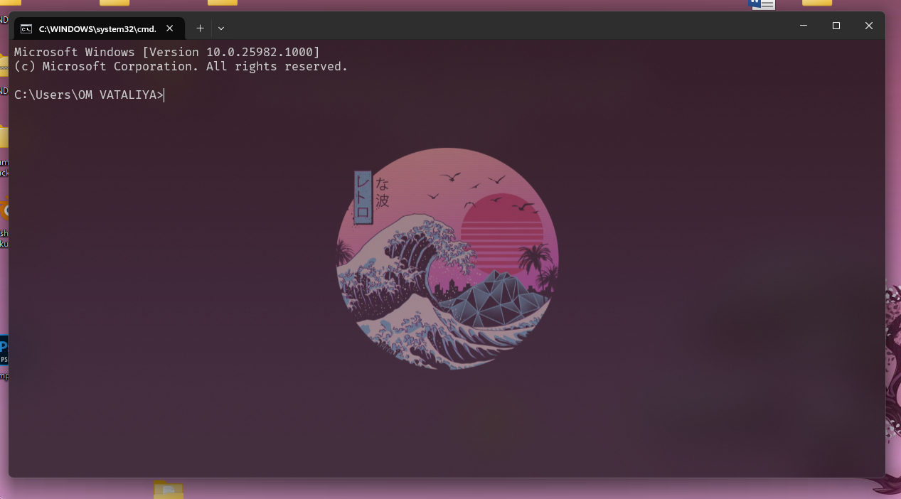
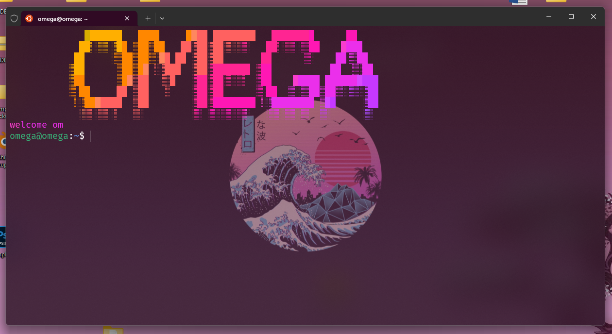

# Making Windows Terminal Transparent

You can customize the transparency of Windows Terminal by editing the settings in your `settings.json` file. In this guide, we will walk you through the steps to make Windows Terminal transparent using a custom configuration.

## Prerequisites

Before you begin, ensure that you have [Windows Terminal](https://aka.ms/terminal) installed on your Windows system.

## Images



## Steps

1. **Locate Your `settings.json` File**:

   - Open Windows Terminal.
   - Click on the down arrow (▼) located at the top right corner of the window to open the dropdown menu.
   - Select "Settings" to open the `settings.json` file in your default text editor.

   

2. **Edit `settings.json`**:

   - In the `settings.json` file, locate the "defaults" section.
   - Add or modify the following properties to achieve transparency:

   ```json
   "defaults": {
       "backgroundImage": "C:\\Users\\YourUsername\\Pictures\\Wallpapers\\wallpaperflare.com_wallpaper (1).jpg",
       "backgroundImageOpacity": 0.4,
       "font": {
           "face": "FiraCode Nerd Font Propo"
       },
       "opacity": 50,
       "useAcrylic": true
   },
   ```

   - Customize the values to your preferences. Here's what each property does:
     - `backgroundImage`: Specify the path to the image you want to use as the background.
     - `backgroundImageOpacity`: Adjust the opacity of the background image (0.0 to 1.0).
     - `font`: Define the font and its properties.
     - `opacity`: Set the overall terminal window opacity (0 to 100).
     - `useAcrylic`: Enable or disable acrylic (a type of background blur) based on your preference.

3. **Save `settings.json`**:

   - Save the `settings.json` file after making the changes.

4. **Restart Windows Terminal**:

   - Close and reopen Windows Terminal for the changes to take effect.

   

5. **Enjoy Transparent Windows Terminal**:

   Your Windows Terminal should now have a transparent background based on your custom settings.

   

## Additional Notes

- Make sure to replace `"C:\\Users\\YourUsername\\Pictures\\Wallpapers\\wallpaperflare.com_wallpaper (1).jpg"` with the actual path to your desired background image.
- Adjust the `backgroundImageOpacity` and `opacity` values to your liking. Higher values will make the terminal more opaque, while lower values will increase transparency.

You now have a customized, transparent Windows Terminal to enhance your command-line experience.
